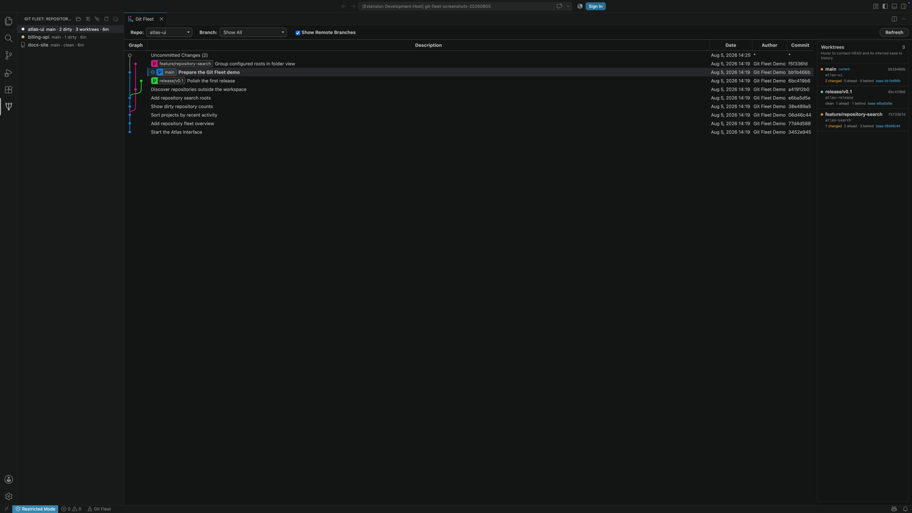
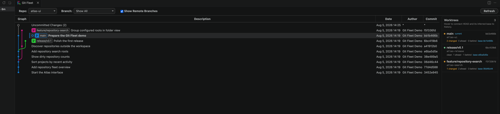

<div align="center">
  
  <h1>Git Fleet</h1>
  <p><strong>One pane for every repository. A familiar Git graph for each one.</strong></p>
</div>

[](https://github.com/wrgrant/git-fleet/actions/workflows/ci.yaml)
[](https://github.com/wrgrant/git-fleet/releases)
[](LICENSE)

Git Fleet is a VS Code extension for people working across more repositories and Git worktrees than the built-in Source Control pane makes easy to watch. Its compact Activity Bar navigator tells you what is active, what is dirty, and where each repository lives. Selecting a repository opens the graph and Git actions inherited from Neo Git Graph.



## What Git Fleet adds

- A dedicated Activity Bar pane instead of another toolbar inside Source Control
- Repository discovery below every workspace folder, including nested projects
- Optional global search roots for repositories outside the current workspace
- Independent list/folder-tree layouts with recent-activity, dirty-file, or alphabetical sorting
- A persistent eye control that hides clean repositories
- Compact repository rows that preserve age and branch context, with clean/dirty status pinned at the right edge
- A clickable Uncommitted Changes row with the same file tree and diff flow as a commit
- A worktree rail showing each checkout's HEAD, dirty state, branch, and inferred base
- Viewport-edge arrows when a worktree connector continues above or below the loaded history



The repository navigator is intentionally read-only. Repository-level actions—checkout, branch, merge, tag, reset, cherry-pick, and more—stay in the graph where their context is visible.

## Install

Git Fleet is not yet listed in the VS Code Marketplace. Download the latest `.vsix` from [GitHub Releases](https://github.com/wrgrant/git-fleet/releases), then run:

```sh
code --install-extension git-fleet-v0.2.0.vsix
```

Or choose **Extensions: Install from VSIX...** from the VS Code Command Palette.

After installation, select the Git Fleet icon in the Activity Bar. The folder-plus button opens the native folder chooser. The adjacent settings button opens **Git Fleet: Watched Folders**, where extra folders can be added or removed without editing JSON.

## Configuration

All extension settings use the `git-fleet` prefix.

| Setting                                | Default | Purpose                                           |
| -------------------------------------- | ------- | ------------------------------------------------- |
| `git-fleet.repositorySearchRoots`      | `[]`    | Additional folders to scan in every window        |
| `git-fleet.maxDepthOfRepoSearch`       | `4`     | Nested folder depth used for repository discovery |
| `git-fleet.showUncommittedChanges`     | `true`  | Show working changes as the first graph row       |
| `git-fleet.showCurrentBranchByDefault` | `false` | Open the graph filtered to the current branch     |
| `git-fleet.initialLoadCommits`         | `300`   | Initial graph history length                      |
| `git-fleet.loadMoreCommits`            | `100`   | Additional commits loaded on demand               |
| `git-fleet.fetchAvatars`               | `false` | Fetch commit avatars from external services       |

The full settings list is available in VS Code under **Extensions → Git Fleet**.

## Worktree history

Git records a worktree's current HEAD but not the exact commit from which that worktree was originally created. Git Fleet therefore draws HEAD connectors as confirmed state and labels base connectors as inferred merge bases against the repository's default branch. That distinction is deliberate.

## Project lineage and attribution

Git Fleet is an MIT-licensed fork of [asispts/neo-git-graph](https://github.com/asispts/neo-git-graph). Neo Git Graph is based on the last MIT-licensed commit of Michael Hutchison's [mhutchie/vscode-git-graph](https://github.com/mhutchie/vscode-git-graph), commit [`4af8583`](https://github.com/mhutchie/vscode-git-graph/commit/4af8583a42082b2c230d2c0187d4eaff4b69c665).

Git Fleet preserves the MIT license and copyright notices from both upstream projects. It is maintained independently and is not affiliated with or endorsed by either upstream project. See [NOTICE.md](NOTICE.md) for the attribution chain.

## Development

```sh
pnpm install
pnpm run typecheck
pnpm run lint
pnpm run test
pnpm run package
```

Contributions are welcome. Start with [CONTRIBUTING.md](CONTRIBUTING.md), see [ROADMAP.md](ROADMAP.md) for planned work, and use [docs/PUBLISHING.md](docs/PUBLISHING.md) for the release process.

## License

[MIT](LICENSE) © Michael Hutchison, Asis Pattisahusiwa, and Git Fleet contributors.
